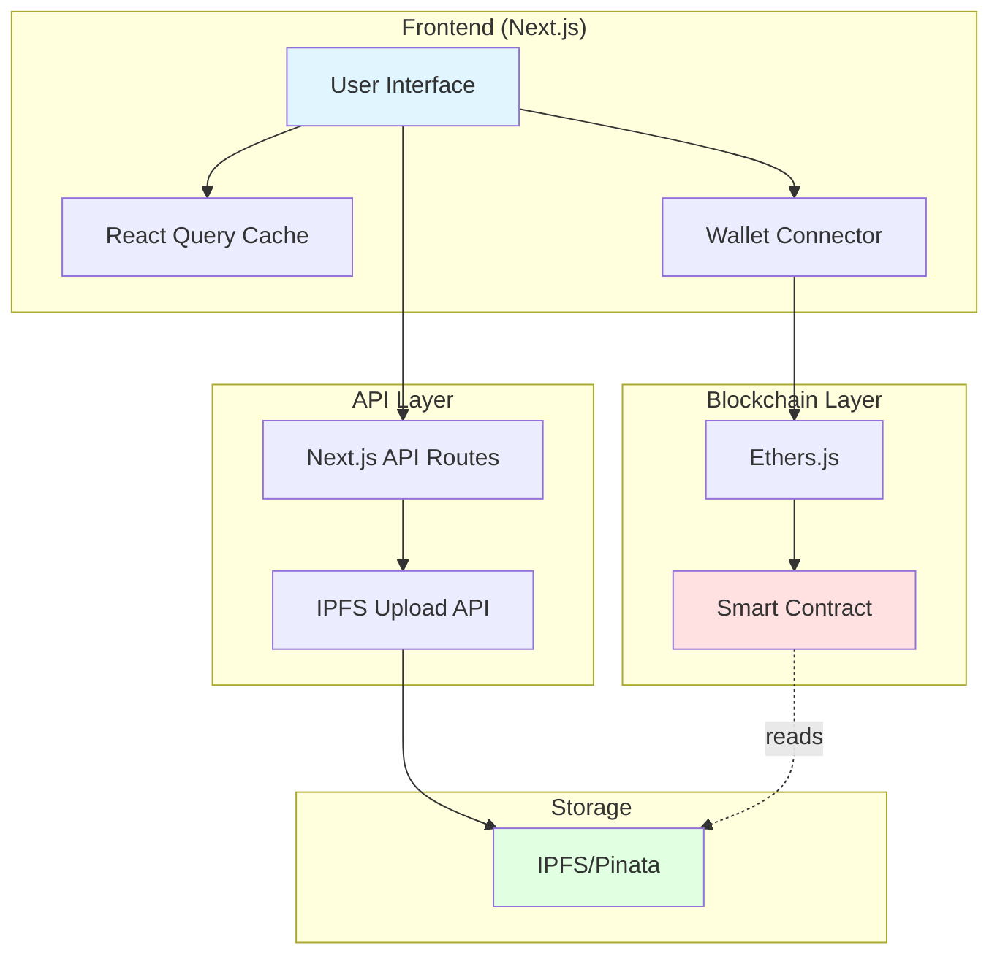
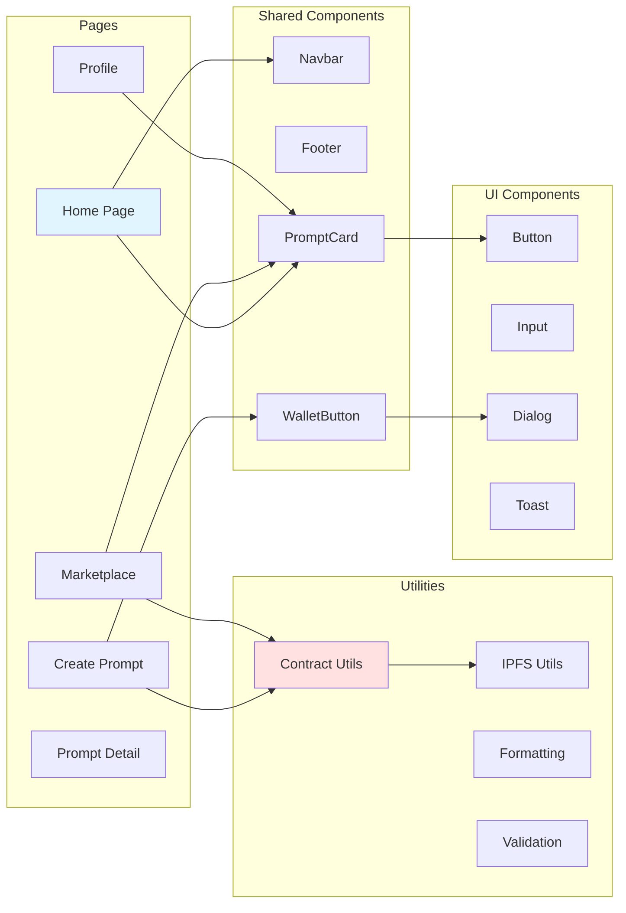
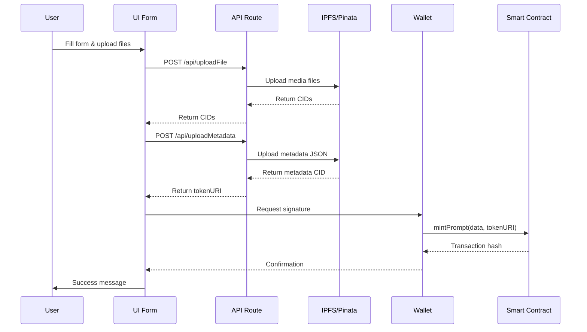
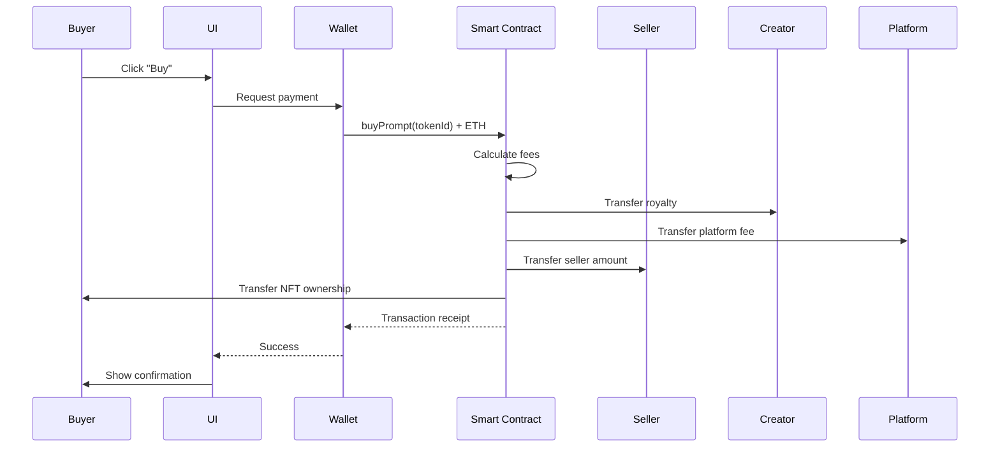
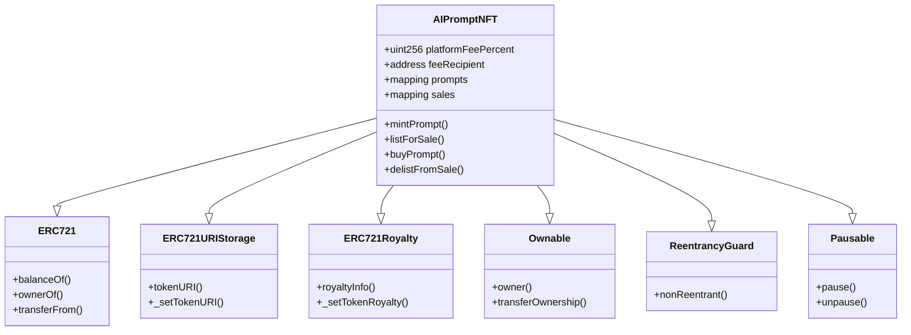
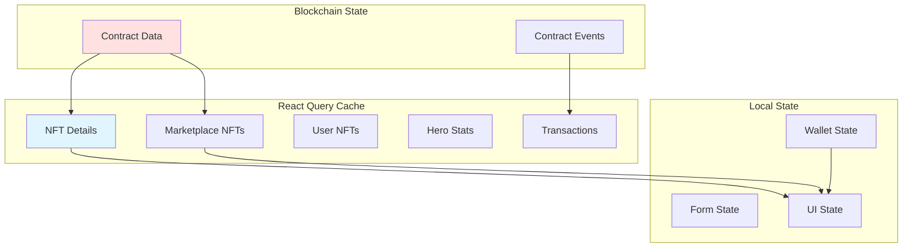
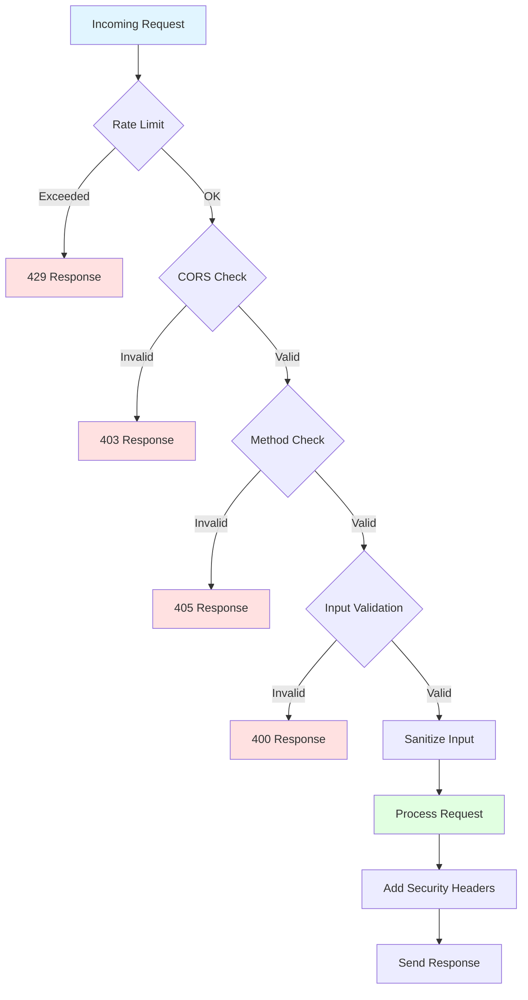
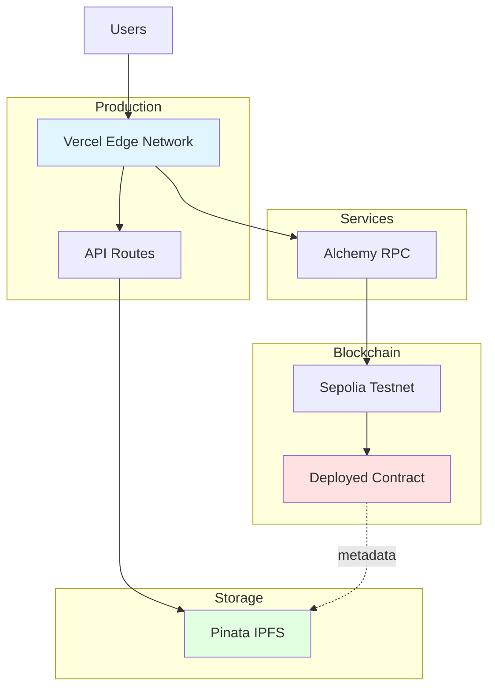

# PromptVerse Architecture

## System Overview

PromptVerse is a decentralized NFT marketplace for AI prompts built on Ethereum. The application follows a modern web3 architecture with Next.js frontend and smart contract backend.

## Component Architecture

## Data Flow

### Minting Flow

### Purchase Flow

## Smart Contract Architecture

## State Management

## Security Layers

## Deployment Architecture

## Technology Stack

### Frontend

- **Framework**: Next.js 15 (App Router)
- **Language**: TypeScript
- **Styling**: Tailwind CSS
- **UI Components**: Radix UI
- **State Management**: React Query
- **Web3**: Ethers.js v6

### Backend

- **API**: Next.js API Routes
- **Smart Contracts**: Solidity 0.8.20
- **Development**: Hardhat
- **Storage**: IPFS via Pinata

### Infrastructure

- **Hosting**: Vercel
- **Blockchain**: Ethereum (Sepolia Testnet)
- **RPC Provider**: Alchemy
- **IPFS Gateway**: Pinata

## Key Design Decisions

### 1. React Query for Caching

- Reduces blockchain RPC calls
- Automatic background refetching
- Optimistic updates for better UX

### 2. IPFS for Metadata

- Decentralized storage
- Permanent content addressing
- Reduced on-chain storage costs

### 3. ERC-721 with Extensions

- Standard NFT compatibility
- Built-in royalty support (ERC-2981)
- URI storage for metadata

### 4. Pausable Contract

- Emergency stop mechanism
- Owner can pause trading
- Security best practice

### 5. ReentrancyGuard

- Prevents reentrancy attacks
- Protects payment distribution
- Critical for financial operations

## Performance Optimizations

1. **React Query Caching**: Reduces redundant blockchain calls
2. **Lazy Loading**: Components load on demand
3. **Image Optimization**: Next.js Image component
4. **Code Splitting**: Automatic route-based splitting
5. **Batch Event Queries**: Reduces RPC calls for historical data

## Security Measures

1. **Input Validation**: Zod schemas for all forms
2. **XSS Prevention**: Input sanitization
3. **Rate Limiting**: API route protection
4. **CORS**: Origin validation
5. **CSP Headers**: Content Security Policy
6. **Smart Contract Auditing**: OpenZeppelin libraries

## Scalability Considerations

### Current Limitations

- Event queries scale linearly with token count
- In-memory rate limiting (not distributed)
- Client-side caching only

### Future Improvements

- Implement subgraph for event indexing
- Use Redis for distributed rate limiting
- Add server-side caching layer
- Implement pagination for large collections
